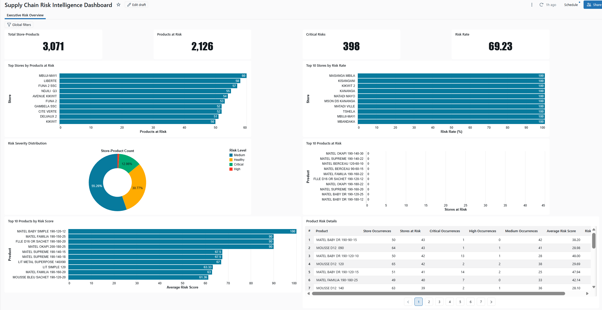

# Enterprise AI Supply Chain Platform

End-to-end **Supply Chain Data & AI Platform** built with Databricks Lakehouse, Apache Spark, SQL, Machine Learning, and interactive Risk Intelligence dashboards.

The project demonstrates how operational retail and supply chain data can be transformed into analytics, predictive models, risk intelligence, and decision-support solutions.

---

## Project Overview

This project implements an end-to-end Data & AI pipeline for retail and supply chain analytics.

Raw operational data is progressively transformed into clean analytical datasets, business KPIs, machine learning features, predictive models, supply chain risk indicators, and interactive executive dashboards.

### End-to-End Flow

```text
Raw Operational Data
        ↓
Bronze Layer
        ↓
Silver Layer
        ↓
Gold Analytical Layer
        ↓
Analytics & KPIs
        ↓
Machine Learning
        ↓
Risk Intelligence
        ↓
Executive Dashboard
```

The architecture follows the Databricks Lakehouse approach and separates ingestion, transformation, analytics, machine learning, and decision intelligence.

---

## Business Objectives

The platform is designed to help organizations:

- Monitor sales and supply chain operations
- Analyze inventory and product performance
- Identify products and stores exposed to operational risk
- Detect abnormal operational patterns
- Prioritize critical supply chain situations
- Support demand forecasting
- Transform operational data into actionable intelligence
- Support data-driven operational and executive decisions

---

## Lakehouse Architecture

### Bronze Layer

Raw operational data ingestion and preservation.

The Bronze layer maintains source-level information before business transformations are applied.

### Silver Layer

Data cleaning, standardization, validation, deduplication, and preparation of analytical dimensions.

This layer creates reliable datasets that can be reused across analytics and machine learning workflows.

### Gold Layer

Business-ready analytical datasets, aggregations, and KPIs.

Gold datasets provide optimized information for reporting, business analysis, machine learning, and decision-support applications.

### Analytics Layer

Business metrics and analytical views are generated for:

- Sales performance
- Product performance
- Store performance
- Inventory analysis
- Supply chain operations
- Operational anomalies

### Machine Learning Layer

The platform includes forecasting experiments and machine learning workflows designed to support predictive supply chain analytics.

### Risk Intelligence Layer

Analytical and operational indicators are transformed into product-store risk scores and severity classifications.

This layer helps identify and prioritize situations requiring operational attention.

### BI & Decision Intelligence Layer

Databricks AI/BI dashboards transform the analytical and risk datasets into interactive decision-support interfaces for operational and executive users.

---

## Supply Chain Risk Intelligence Dashboard

A dedicated **Supply Chain Risk Intelligence Dashboard** was developed in Databricks to provide an executive view of operational risk across stores and products.

### Executive KPIs

| KPI | Value |
|---|---:|
| Total Store-Products | 3,071 |
| Products at Risk | 2,126 |
| Critical Risks | 398 |
| Risk Rate | 69.23% |

### Dashboard Capabilities

The dashboard provides:

- Executive supply chain risk monitoring
- Store-level risk analysis
- Product-level risk analysis
- Risk severity distribution
- Critical, High, Medium, and Healthy risk classification
- Critical, High, and Medium occurrence analysis
- Average product risk scoring
- Top stores by products at risk
- Top stores by risk rate
- Top products at risk
- Top products by average risk score
- Interactive Store filtering
- Interactive Risk Level filtering
- Detailed product risk investigation

### Dashboard Preview



The dashboard converts analytical outputs into a decision-support interface that allows users to move from global risk indicators to individual product-level investigation.

---

## Machine Learning

The project includes demand forecasting experiments using several baseline and machine learning approaches.

### Models Evaluated

- Naive-1 baseline
- Naive-7 baseline
- Rolling mean baseline
- Gradient Boosted Tree Regressor

The Gradient Boosted Tree model was implemented using Spark ML.

The current machine learning workflow establishes the foundation for experiment tracking, model comparison, model management, and production-oriented ML workflows.

---

## Risk Intelligence

The Risk Intelligence component extends traditional BI by transforming operational indicators into prioritized risk information.

The analytical workflow evaluates product-store situations and produces indicators such as:

- Risk score
- Risk level
- Critical occurrences
- High-risk occurrences
- Medium-risk occurrences
- Store occurrences
- Stores at risk
- Average product risk score

These indicators are consumed by the executive dashboard for operational prioritization.

---

## Technology Stack

### Data Engineering

- Databricks
- Apache Spark
- PySpark
- Spark SQL
- Delta Lake
- Databricks Lakehouse

### Analytics

- SQL
- Python
- Databricks SQL
- Analytical marts
- KPI modeling

### Machine Learning

- Spark ML
- Gradient Boosted Tree Regressor
- Forecasting baselines
- Feature engineering

### Business Intelligence

- Databricks AI/BI Dashboards
- Interactive filters
- Executive KPIs
- Risk Intelligence visualizations

### Development & Version Control

- Python
- SQL
- Git
- GitHub

---

## Project Pipeline

The current implementation follows this workflow:

```text
01 - Raw Data Ingestion
        ↓
02 - Bronze Cleaning
        ↓
03 - Silver Dimensions
        ↓
04 - Gold Analytical Marts
        ↓
05 - Anomaly Detection
        ↓
06 - Forecasting Baselines & GBT Model
        ↓
07 - Supply Chain Risk Analytics
        ↓
08 - Risk Intelligence Dashboard
```

---

## Data Privacy

The original operational datasets used during development are **not included in this public repository**.

The public repository is intended as a technical and professional portfolio and contains only non-sensitive artifacts such as:

- Architecture documentation
- Analytical logic
- Project documentation
- Selected code and notebooks
- Non-sensitive screenshots
- Portfolio artifacts

No confidential operational dataset, credential, password, connection string, or sensitive business information should be committed to this repository.

---

## Project Status

**Active Development**

### Completed

- Raw data ingestion
- Bronze layer
- Silver layer
- Gold analytical marts
- Analytical KPIs
- Anomaly detection
- Forecasting baselines
- Gradient Boosted Tree forecasting model
- Supply chain risk analytics
- Risk scoring
- Risk severity classification
- Supply Chain Risk Intelligence Dashboard
- Interactive Store and Risk Level filtering
- GitHub portfolio documentation

### Next Development Phase

The next phase focuses on bringing the machine learning component closer to a production-oriented MLOps architecture:

```text
MLflow Experiment Tracking
        ↓
Model Comparison
        ↓
Model Management
        ↓
API Integration
        ↓
Containerization
        ↓
Monitoring
        ↓
Production-Oriented Architecture
```

---

## Roadmap

Planned improvements include:

- MLflow experiment tracking
- Model performance comparison
- Model registration and lifecycle management
- Forecasting API
- FastAPI integration
- Docker-based deployment architecture
- Model and data monitoring
- Automated pipeline execution
- Additional Supply Chain AI use cases
- Production-oriented architecture documentation

---

## Repository Purpose

This repository demonstrates practical skills across the complete Data & AI lifecycle:

**Data Engineering → Data Analytics → Machine Learning → Risk Intelligence → Business Intelligence → MLOps**

The objective is not only to build predictive models, but to demonstrate how data engineering, analytics, machine learning, and business intelligence can be integrated into an end-to-end enterprise decision-support platform.

---

## Author

**Ruben KANKU**

Data Analytics • Data Science • Artificial Intelligence • Digital Transformation
