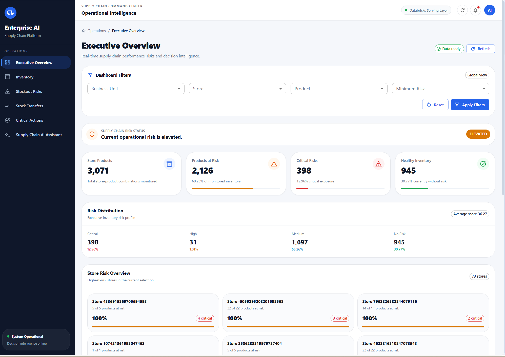
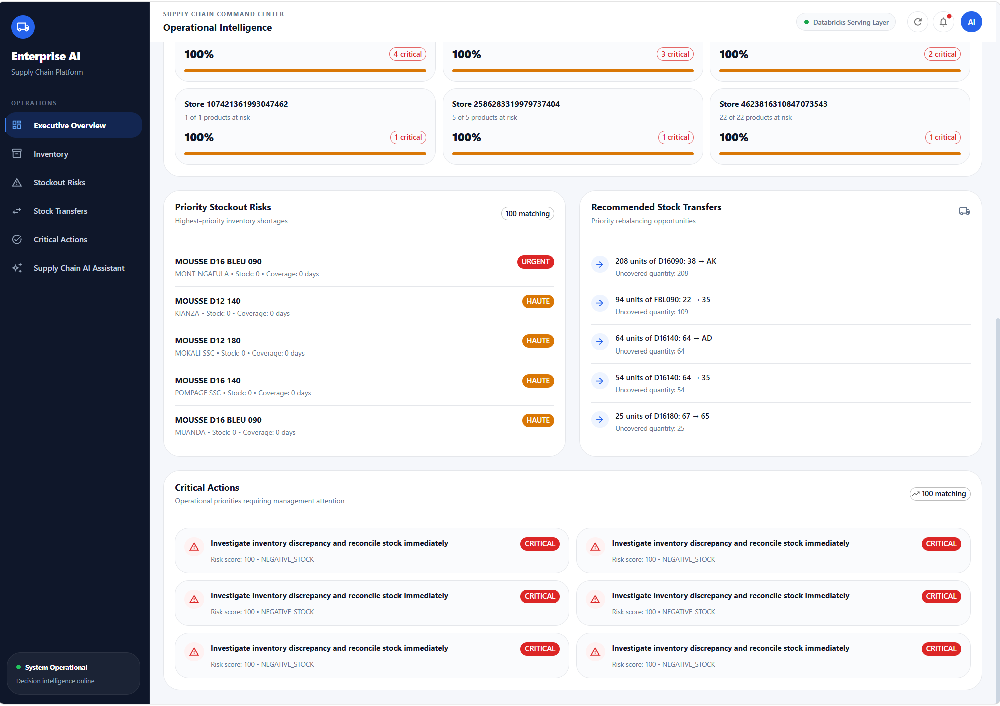
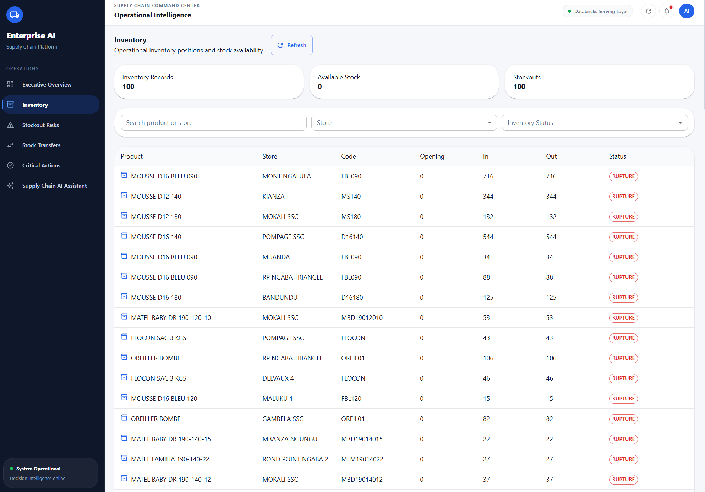

# Enterprise AI Supply Chain Platform

An end-to-end **AI-powered Supply Chain Decision Intelligence Platform** combining **Databricks, FastAPI, React, and AI** to transform operational retail data into inventory intelligence, stockout alerts, transfer recommendations, critical actions, and management-ready insights.

The project demonstrates a production-oriented architecture connecting **data engineering, analytics, decision intelligence, API services, AI-assisted analysis, and an operational command center**.

---

## Project Overview

Supply chain teams often have large volumes of operational data but still struggle to answer critical questions such as:

- Which stores are at risk of stockout?
- Which products require immediate attention?
- Where is inventory excessive?
- Can excess stock from one store cover shortages in another?
- Which operational actions should management prioritize?
- Can business users query supply-chain information using natural language?

This platform addresses these challenges through an integrated **Supply Chain Decision Intelligence architecture**.

```text
Operational Data
       |
       v
Databricks Lakehouse
       |
       v
Data Engineering & Analytics
       |
       v
Supply Chain Risk Engine
       |
       +----------------------+
       |                      |
       v                      v
Inventory Intelligence   Stockout Intelligence
       |                      |
       +-----------+----------+
                   |
                   v
        Transfer Recommendations
                   |
                   v
           Critical Actions
                   |
                   v
        Databricks Serving Layer
                   |
                   v
              FastAPI API
                   |
          +--------+--------+
          |                 |
          v                 v
 React Command Center    AI Assistant
```

---

## Key Capabilities

### Executive Overview

A management-oriented command center providing a consolidated view of supply-chain performance and operational risks.

The dashboard surfaces key indicators and enables decision-makers to quickly identify stores, products, and operational situations requiring attention.

### Inventory Intelligence

Provides store- and product-level inventory visibility, including:

- available stock
- inventory status
- product information
- store information
- stock movements
- inventory health indicators

### Stockout Risk Intelligence

Detects products and stores exposed to potential stock shortages using inventory positions and recent sales activity.

Operational indicators include:

- current stock
- 30-day sales
- average daily sales
- days of stock
- stockout priority
- priority ranking
- inventory status

### Intelligent Stock Transfers

Generates inventory rebalancing recommendations between stores.

For each recommendation, the platform identifies:

- product
- donor store
- receiver store
- donor stock
- receiver stock
- uncovered demand
- transferable stock
- proposed transfer quantity
- replenishment priority

Instead of exposing internal surrogate keys to business users, the application resolves stores into readable business names and codes.

Example:

```text
DELVAUX 3 (38)  ->  POMPAGE SSC (AK)
```

### Critical Actions

Transforms analytical risk signals into a prioritized operational action queue.

The interface highlights:

- severity
- primary risk
- risk score
- affected store
- affected product
- recommended operational action

This enables management to move from **analytics to action**.

### Supply Chain AI Assistant

The platform includes an AI assistant designed for natural-language interaction with supply-chain information.

The assistant architecture includes:

- intent routing
- decision context
- grounding
- AI decision services
- LLM integration
- supply-chain context retrieval

The project supports local LLM experimentation through **Ollama**, enabling AI-assisted capabilities without requiring a paid external LLM API.

---

## Technology Stack

| Layer | Technology |
|---|---|
| Data Platform | Databricks |
| Data Processing | SQL / Python |
| Analytical Architecture | Lakehouse |
| Serving Layer | Databricks SQL |
| Backend API | FastAPI |
| Backend Language | Python |
| Frontend | React |
| Build Tool | Vite |
| UI Framework | Material UI |
| API Communication | Axios |
| AI / LLM | Ollama |
| Architecture | REST API + Decision Intelligence |

---

## Databricks Architecture

The analytical platform is organized into multiple logical layers that progressively transform operational data into decision-ready information.

### Gold Layer

The Gold layer contains business-ready analytical datasets used by the risk and decision engines.

Examples include:

```text
daily_sales
dim_store
fact_inventory
fact_sales
fact_stock_movements
inventory_health
inventory_health_v2
replenishment_recommendations
shop_risk_score
stockout_alerts
supply_chain_risk_mart
```

### Mart Layer

Decision-oriented analytical marts provide consolidated risk information for operational applications.

Examples include:

```text
critical_risk_actions
risk_by_store
supply_chain_critical_actions
supply_chain_risk_by_store
supply_chain_risk_dashboard
```

### Serving Layer

The serving layer exposes curated datasets optimized for the operational application.

Current serving objects include:

```text
critical_risk_actions
executive_risk
product_risk_score
risk_by_product
risk_by_store
stock_transfer_recommendations
stockout_alerts
```

The FastAPI backend queries this layer instead of exposing raw analytical tables directly to the frontend.

---

## Backend API

The backend is implemented with **FastAPI** and acts as the application service layer between Databricks and the React frontend.

API areas include:

```text
/api/v1/stockouts/alerts
/api/v1/transfers/recommendations
```

Additional routes support:

- inventory intelligence
- executive risk information
- critical actions
- stockout intelligence
- transfer recommendations
- AI-assisted decision workflows

### Example Transfer Response

```json
{
  "article": "D16090",
  "donor_store_code": "38",
  "donor_store_name": "DELVAUX 3",
  "receiver_store_code": "AK",
  "receiver_store_name": "POMPAGE SSC",
  "donor_stock": 902,
  "receiver_stock": 15,
  "uncovered_qty": 208,
  "proposed_transfer_qty": 208,
  "replenishment_priority": "URGENT"
}
```

---

## Frontend Command Center

The React application provides the operational interface of the platform.

Main application pages include:

```text
Executive Overview
Inventory
Stockout Risks
Stock Transfers
Critical Actions
Supply Chain AI Assistant
```

The interface is designed as a **Supply Chain Command Center**, rather than a traditional reporting dashboard.

Its purpose is to help users answer three fundamental questions:

> **What is happening?**

> **Where is the risk?**

> **What should we do?**

---

# Application Screenshots

## Executive Overview

Management-level visibility into supply-chain performance, inventory exposure, stockout risks, and operational priorities.



---

## Executive Risk Intelligence

A complementary executive view highlighting operational risk indicators and areas requiring management attention.



---

## Inventory Intelligence

Store- and product-level inventory visibility for monitoring stock positions and inventory health.



---

## Stockout Risk Intelligence

Prioritized stockout alerts based on inventory positions and recent demand.


---

## Intelligent Stock Transfers

Inventory rebalancing recommendations identifying donor stores, receiver stores, available stock, uncovered demand, and proposed transfer quantities.


---

## Critical Actions

Prioritized operational actions generated from supply-chain risk signals.


---

## Supply Chain AI Assistant

Natural-language decision-support interface for querying supply-chain information and obtaining grounded operational insights.


---

## Project Structure

```text
enterprise-ai-supply-chain-platform/
|
|-- app/
|   |-- api/
|   |   `-- routes/
|   |
|   |-- core/
|   |
|   |-- db/
|   |
|   |-- schemas/
|   |
|   `-- services/
|       |-- ai_assistant.py
|       |-- ai_decision.py
|       |-- context_router.py
|       |-- decision_context.py
|       |-- grounding.py
|       |-- intent_router.py
|       `-- ollama.py
|
|-- docs/
|   `-- screenshots/
|
|-- frontend/
|   |-- src/
|   |   |-- components/
|   |   |   `-- layout/
|   |   |       |-- Sidebar.jsx
|   |   |       `-- Topbar.jsx
|   |   |
|   |   |-- pages/
|   |   |   |-- Dashboard.jsx
|   |   |   |-- Inventory.jsx
|   |   |   |-- StockoutRisks.jsx
|   |   |   |-- Transfers.jsx
|   |   |   |-- CriticalActions.jsx
|   |   |   `-- AIAssistant.jsx
|   |   |
|   |   |-- services/
|   |   |   `-- api.js
|   |   |
|   |   `-- styles/
|   |       `-- theme.js
|   |
|   `-- package.json
|
|-- scripts/
|   `-- validate_ai_assistant.py
|
|-- .env.example
|-- .gitignore
|-- requirements.txt
`-- README.md
```

---

## Running the Backend

Install the Python dependencies:

```bash
pip install -r requirements.txt
```

Create your local environment configuration based on:

```text
.env.example
```

Then start the FastAPI application:

```bash
uvicorn app.main:app --reload
```

---

## Running the Frontend

Move into the frontend directory:

```bash
cd frontend
```

Install dependencies:

```bash
npm install
```

Start the development server:

```bash
npm run dev
```

Create a production build:

```bash
npm run build
```

---

## Environment Variables

Sensitive credentials are intentionally excluded from the repository.

Use the provided:

```text
.env.example
frontend/.env.example
```

to configure the required environment variables locally.

Do **not** commit:

```text
.env
frontend/.env
Databricks access tokens
database credentials
API secrets
private infrastructure credentials
```

---

## Validation

The frontend has been validated using the production build:

```bash
npm run build
```

The project also contains an AI assistant validation script:

```bash
python scripts/validate_ai_assistant.py
```

---

## Business Value

This project demonstrates how a modern data platform can evolve beyond traditional dashboards.

Traditional Business Intelligence typically answers:

```text
What happened?
```

This platform extends that approach toward:

```text
What is happening?
        |
        v
What is at risk?
        |
        v
What should be prioritized?
        |
        v
What action should be taken?
```

The result is a practical **Supply Chain Decision Intelligence Platform** connecting data engineering, analytics, AI, APIs, and an operational user interface.

---

## Use Cases

The architecture can support retail and distribution environments requiring:

- multi-store inventory monitoring
- stockout prevention
- inventory rebalancing
- demand-aware replenishment
- supply-chain risk prioritization
- management decision support
- AI-assisted operational analytics

---

## Engineering Focus

This portfolio project demonstrates practical experience across multiple areas.

### Data Engineering

Databricks, Lakehouse architecture, analytical data modeling, transformations, marts, and serving datasets.

### Data Analytics

Inventory analysis, demand indicators, stockout detection, and store/product risk analysis.

### Backend Engineering

FastAPI, REST APIs, Databricks query integration, and application services.

### Frontend Engineering

React, Material UI, Axios, responsive operational interfaces, and decision-support dashboards.

### Artificial Intelligence

Natural-language interaction, intent routing, grounding, decision context, AI services, and local LLM integration.

### Decision Intelligence

Transforming analytical signals into prioritized operational recommendations and management actions.

---

## Security

The public repository contains only application code, documentation, screenshots, and non-sensitive configuration examples intended for demonstration purposes.

Sensitive information must remain outside version control, including:

- production credentials
- access tokens
- private datasets
- database passwords
- API secrets
- private infrastructure configuration

The `.gitignore` configuration prevents local environment files and generated application artifacts from being committed.

---

## Project Status

**Functional End-to-End Prototype**

Implemented components include:

- Databricks analytical architecture
- Gold analytical datasets
- decision-oriented marts
- serving layer
- supply-chain risk intelligence
- inventory intelligence
- stockout alerts
- stock-transfer recommendations
- critical-action prioritization
- FastAPI serving backend
- React operational command center
- AI assistant architecture
- local LLM integration with Ollama
- production frontend build validation

---

## Author

**Ruben KANKU**

**Data & AI | Business Intelligence | Digital Transformation**

Democratic Republic of the Congo

---

## Disclaimer

This repository is a **portfolio and demonstration project**.

Operational data used during development should be handled according to applicable confidentiality and data-governance requirements.

Sensitive source datasets, credentials, access tokens, and private infrastructure information are not intended for public distribution.